<h1 align="center">👋 Hi, I'm Jeon Hyun Oh</h1>

  <strong>AX & Unity Developer</strong> 
  AI/AX Automation · Vibe Coding · Unity 3D/2D

  
  
  
  

---

## 🧠 About Me

대학에서 소프트웨어공학·컴퓨터공학을 공부하며 Unity를 처음 접한 뒤, UI·물리·네트워크·데이터 흐름이 하나의 시스템으로 맞물리는 구조에 매료되었습니다.
게임 개발 시장의 AI 전환 흐름에 올라타 **AX 개발 인턴십**을 경험했고, 이후 **Claude Code**를 활용한 바이브코딩으로 개인 프로젝트를 직접 기획·설계·배포하고 있습니다.

모르는 도메인을 빠르게 파악해 **작동하는 형태로 만들어내는 것**이 제가 가장 잘하고 싶은 일입니다.

---

## 💼 Experience & Education

| | Organization | Role | Duration |
|---|---|---|---|
| 🏢 | **마크클라우드 (Markcloud)** | AX 개발 인턴 — n8n 기반 콘텐츠 자동화 파이프라인 구축 | 2025.12 – 2026.01 |
| 🏢 | **아티팩트 (Artifact)** | 게임 기획 인턴 — QA 검증, 경쟁작 BM 리서치, 다국어 현지화 보조 | 2023.07 – 2023.08 |
| 🎓 | **스파르타코딩클럽** | Unity 게임 개발 부트캠프 수료 | 4개월 |
| 🎓 | **성공회대학교** | 소프트웨어공학 전공 / 컴퓨터공학 부전공 | 2019.03 – 2025.03 |

---

## 🛠️ Tech Stacks

**Language**
    

**AI & Automation**
   

**Game & Interactive**
 

**Vibe Coding / FullStack**
     

---

## 🤖 AI/AX Automation Projects

| Project | Description | Stack |
|---------|-------------|-------|
| [MarkView Content Automation](https://github.com/gusdh8380/MarkView-Content-Automation) | 키워드 입력 한 번으로 영상 녹화 → YouTube 업로드 → 블로그 초안 생성 → Notion 저장까지 3–5분 내 완료하는 홍보 자동화 파이프라인 | n8n, FastAPI, Playwright, FFmpeg, Docker, GPT API |
| [게임VOC 분석 자동화](https://www.notion.so/VOC-n8n-2bfdd79e416180668ef0e18a0cbd3007) | 게임 리뷰를 매일 자동 수집·분류·분석해 Notion DB 저장 + Slack 리포트 발송. AI Agent 역할 분리로 안정성 확보 | n8n, Google Sheets API, Notion API, Slack API, Gemini |

---

## 📂 Projects

### ✨ Personal

| Project | Description |
|---------|-------------|
| [StructFlow](https://github.com/gusdh8380/StructFlow) | **AI 기반 구조 설계 자동화 파이프라인** — 자연어 한 줄로 Manning 공식 유량 계산 → 구조 응력 분석 → Unity 3D 시각화까지 E2E 자동화. Claude Code 바이브코딩으로 1일 완성, AWS EC2 라이브 운영 중. (Claude API · React · ASP.NET Minimal API · Unity WebGL · n8n · Docker · AWS) |
| [AquaView](https://github.com/gusdh8380/aquaview) | **수처리 공정 모니터링 대시보드** — EPA/WEF 공학 데이터 기반 5단계 하수 처리 공정 시뮬레이션 및 실시간 3D 시각화. HRT 슬라이더로 BOD/TSS/COD 연쇄 계산. (FastAPI · React · Unity WebGL · Docker · AWS EC2) |

### 🙏 Team

| Project | Description |
|---------|-------------|
| [Choice](https://github.com/KimJeongDae22/Project-Choice) | **모바일 하이브리드 디펜스 게임** — 경영+전투 5인 팀 프로젝트. Google Sheets→CSV→ScriptableObject 자동 변환 데이터 드리븐 아키텍처 구축 |
| [Axis](https://github.com/leejy1685/ThreeDevelopmentADay) | **3D 물리 퍼즐 게임** — 레이저 파이프 시스템 전담 설계. IInteractable/ILaserReceiver 인터페이스로 모듈 간 결합도 최소화 (5인 팀) |
| [Miner Commando](https://github.com/gusdh8380/Miner-Commando) | **2D 멀티플레이 협동 게임** — Photon Network 기반 4인 실시간 협동. 씬 전반 설계·공유 인벤토리 실시간 동기화 구현. **성공회대 IT 경진대회 은상** 🥈 |
| [8LATTE-TextRPG](https://github.com/gusdh8380/8LETTE-TextRPG) | 팀 텍스트 RPG "에이트 레인저스" |
| [MedievalSlug](https://github.com/KimJeongDae22/Project-MedievalSlug) | 중세 배경 메탈슬러그 스타일 액션 게임 |

---

## 🏆 Awards

| Award | Detail | Date |
|-------|--------|------|
| 🥈 성공회대학교 IT 경진대회 **은상** | 2D 멀티플레이 픽셀아트 게임 *Miner-Commando* | 2024.10 |

---

  

